

  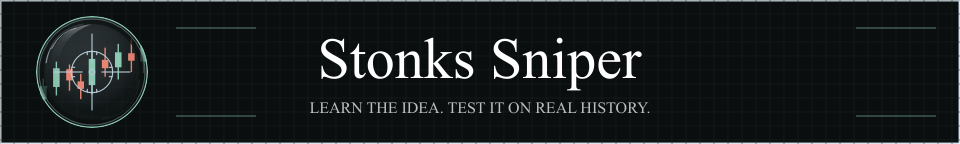

  <a href="docs/guide.md">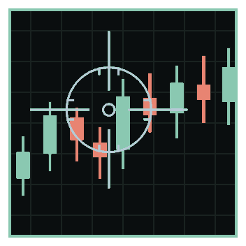</a>

<b>Real history. Practice money. Every word explained.</b>

  <a href="docs/getting-started.md">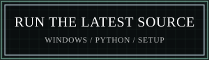</a>
  <a href="docs/guide.md">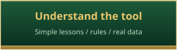</a>
  <a href="https://github.com/Zanark/StonksSniper/releases/tag/v1.0.0">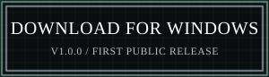</a>

Windows x64: download the .exe; no Python or administrator install required. Unsigned; internet required for Yahoo history. <a href="docs/getting-started.md">Run instructions</a> · <a href="docs/guide.md">Written guide / no-motion alternative</a> · <a href="src/stonks_sniper/assets/logo.svg">Still logo</a> · <a href="src/stonks_sniper/assets/logo.ico">Windows / browser icon</a>

## v1.0.0 - Our first public release

[**Download for Windows**](https://github.com/Zanark/StonksSniper/releases/download/v1.0.0/StonksSniper-1.0.0-windows-x64.exe)
or [read the release notes and checksums](https://github.com/Zanark/StonksSniper/releases/tag/v1.0.0).
All the learning features below are included: 27 strategies and real-history
demos, date-range simulations, The Intelligent Investor companion and the
Market tools practice desk. Python users and agents also get the headless JSON
lab, custom-rule simulations and reusable teaching skill.

Earlier v0.x downloads remain historical prereleases. This milestone is a
public educational release, not a brokerage terminal or a claim that a strategy
will make money. The EXE is unsigned; do not disable Windows security to run it.

The walkthroughs below use actual ICICIBANK history. The visible pointer and
click ripples are overlays; scripted clicks, typing and drags operate the real
native controls. Replay is accelerated, not live trading.
[Prefer no animation? Use the written guide.](docs/guide.md)

## Pick a stock. Test an idea.

*Enter a stock and practice capital, load completed sessions, choose a rule,
then click Test idea. No made-up market data.*

**Simulate**, beside **Test idea**, opens a separate date-range
window with playing buy/sell markers, a trade log, money chart and final
profit/loss in INR and percent. [How it works](docs/guide.md#simulate-your-own-dates).

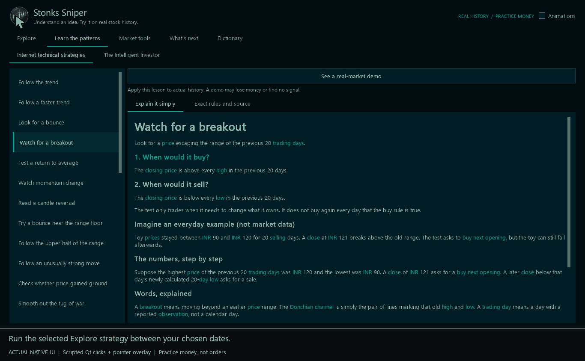
*Your chosen dates, an independent simulation, a money graph and the final
marked profit or loss. Unsold holdings are not silently forced sold.*

## Understand before you test.

**A beginner market-tools practice desk.** **Market tools** adds
20 original Kite-inspired lessons, captured watchlists, chart studies/drawings,
common-session comparison, historical close alerts, opening-only paper orders
with holdings/P&L, and manual risk/allocation/depth/options-expiry labs.
Every tool distinguishes real observations from hypothetical inputs.
[Practical route, exact behaviour and official research sources](docs/market-tools.md).
**No broker login, live feed or real orders.**

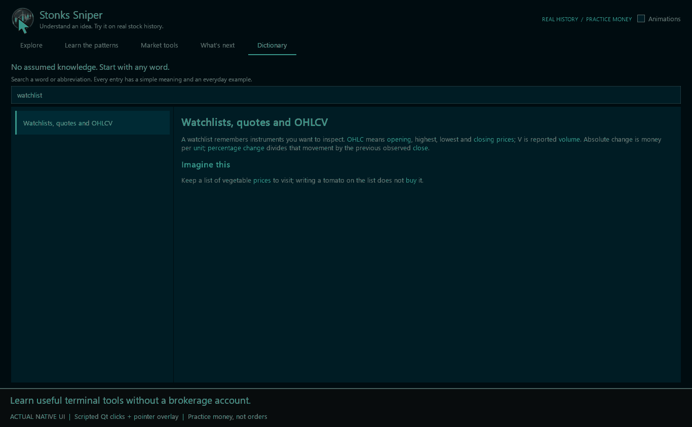
*Capture the loaded history, advance the paper clock, inspect a historical
watchlist and add a chart study. No hidden live quotes.*

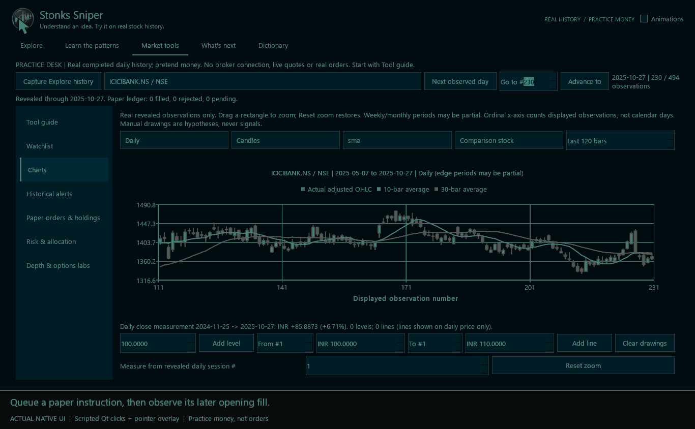
*Queued is not filled: paper instructions wait for a later observed opening.
Follow holdings, costs and realised profit or loss.*

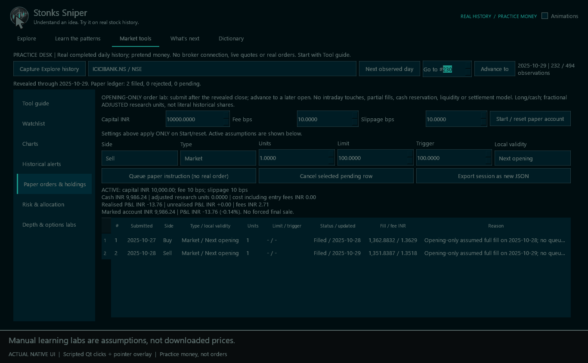
*Risk sizing and options-expiry arithmetic use explicitly manual assumptions,
not downloaded depth, option prices or guaranteed loss limits.*

**Read alongside The Intelligent Investor.** In **Learn the patterns**,
choose **Internet technical strategies** or **The Intelligent Investor**.
The book companion adds original ELI15 notes mapped to 20 main chapters,
a sourced Indian-stock fundamental workbook, defensive/enterprising evidence
checks, valuation/net-net/margin calculations and portfolio exercises.
Missing fundamentals stay unknown; these are not 20 new daily trading signals.
[Coverage, practicals and sources](docs/intelligent-investor.md).

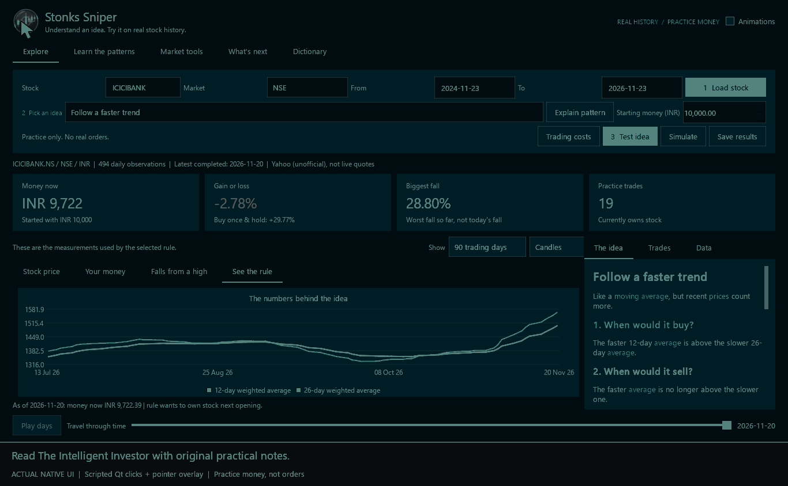
*Read a chapter, open its bounded historical practical, then keep current-company
research separate. An empty workbook refuses to invent evidence.*

**See the idea on actual market history.** Every technical lesson
has **See a real-market demo**: pick a stock/history, inspect the rule's actual
measurements, jump to signals or trades, and compare simulated money with holding.
Applicable book chapters offer bounded history exercises or a separate current-company
worksheet. No winning interval is silently selected; losses/no signals remain visible.

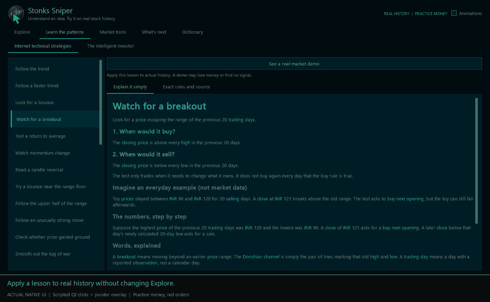
*Follow a lesson into its own actual-history demo. A signal, a later simulated
fill and a profitable result are three different things.*

**For agents and humans:** the [detailed simulation skill](.github/skills/stonks-sniper-lab/SKILL.md)
teaches the headless JSON lab: real history, hypothetical capital, all 27 built-ins,
safe custom-rule hypotheses, reproducible receipts and evidence-based explanations.
It is a teaching/research workflow, not an LLM built into the app or a profit promise.
The desktop demos are in the EXE; run headless commands from the Python package
or source checkout, not from the GUI-only Windows executable.

*Technical lessons: what buys, what sells, the exact sourced rule and what can fail.*

**Study on weekends too.** Loading history does not require an open market:
the app uses actual prior completed sessions and shows their date. Today's
candle is excluded even after close; weekends and holidays are not filled.
An actual Saturday ICICIBANK check returned 496 observations through the prior
Friday. Yahoo availability is still required; [data boundaries](docs/guide.md#actual-history-clear-boundaries).

## Every unfamiliar word has a way in.

*Meaning + example, including the new Market tools vocabulary. Type to search.*

## Watch your practice money.

*The rule versus buying once. Same prices and costs. Inspect falls from a high too.*

## See why the rule acted.

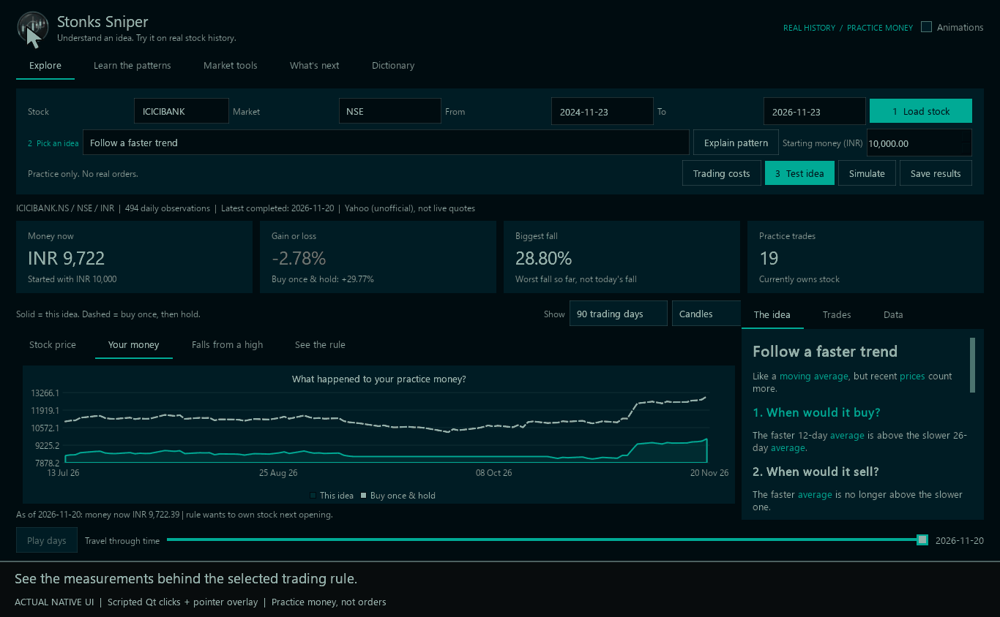
*No mystery score. Scrub through the measurements behind the decision.*

  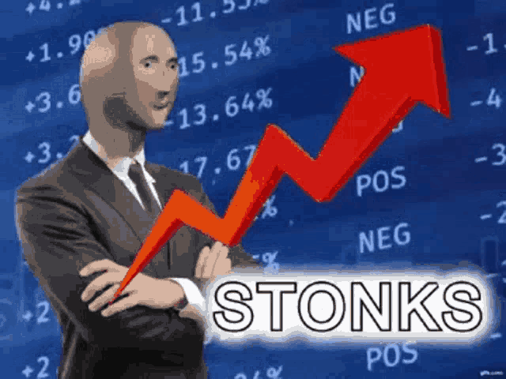

The meme brings the hype. The app explains the ideas.

<a href="docs/strategies.md">All 27 strategies, explained</a> · <a href="docs/guide.md">Rules, sources &amp; limits</a> · <a href="docs/images/gif-captures.json">GIF provenance</a> · <a href="docs/development.md">Build &amp; development</a> · <a href="TODO/00_INDEX.todo">Roadmap</a>

Completed daily history, not live prices. 27 explained rules; baskets and AI are planned. For education and simulation, not investment advice.

GPLv3 application, including GPLv3 Qt Charts. <a href="LICENSE">License</a> · <a href="packaging/THIRD_PARTY_NOTICES.md">Third-party notices</a> · <a href="packaging/SOURCES.md">Corresponding source</a>

